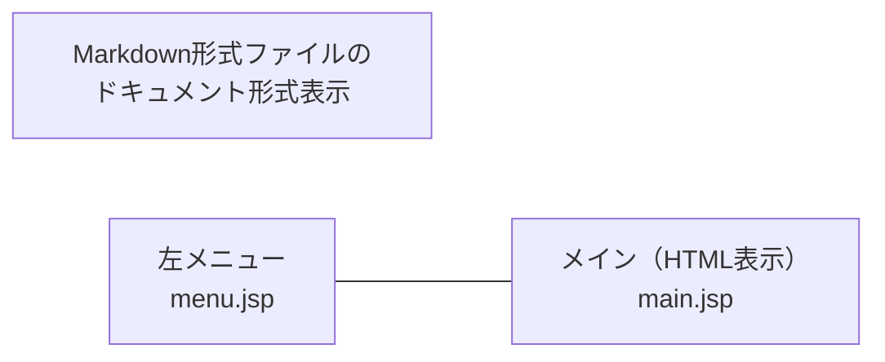

# Markdown形式ファイルのドキュメント形式表示  
Java / Tomcat Webアプリケーション

このアプリケーションは、Markdown形式（`.md`）ファイルをブラウザ上で  
HTMLドキュメント形式として表示する Webビューアです。

左メニューでフォルダまたはファイルを選択すると、  
右側のメイン領域に Markdown が HTML に変換されて表示されます。

---

## 特徴

- `.md` ファイルをブラウザで HTML として閲覧可能  
- フォルダ選択に対応（サブフォルダ含む `.md` を抽出）  
- 複数ファイルの選択に対応  
- 左メニューと右メインの 2 カラムレイアウト  
- 選択ボタンは ▼ アイコンで直感的  
- Tomcat 10/11 の multipart 仕様に対応  
- Java Servlet による Markdown ファイル処理  
- プログラム修正後は `package_restart.sh` により自動ビルド＆再起動可能

---

## 画面構成（レイアウト）



---

## ファイル構成

```
src/main/webapp/
 ├── index.jsp          ← 画面レイアウト（タイトル＋左＋右）
 ├── menu.jsp           ← 左メニュー（フォルダ/ファイル選択）
 ├── main.jsp           ← Markdown HTML表示
 ├── WEB-INF/
 │    └── web.xml
src/main/java/
 └── servlet/
      └── FileSelectServlet.java ← mdファイル抽出＋index.jspへforward

package_restart.sh      ← プログラム修正時の自動ビルド＆再起動スクリプト
```

---

## 動作仕様

### 1. 左メニュー（menu.jsp）
- テキストフィールドに選択した `.md` のファイル名を表示  
- ▼アイコンでフォルダ／ファイル選択ダイアログを開く  
- フォルダ選択時は `.md` のみ抽出  
- 抽出した `.md` は hidden input にセットされ、form submit  
- 左メニューはスクロール可能で、▼が隠れないよう余白を確保

### 2. FileSelectServlet
- multipart/form-data を受け取り `.md` ファイルを抽出  
- `request.setAttribute("files", mdFiles)` を設定  
- `index.jsp` に forward  

### 3. index.jsp
- ページ最上位にタイトルを表示  
- 左メニュー（menu.jsp）と右メイン（main.jsp）を横並びで表示  
- `files` が存在する場合は main.jsp を include  
- 初期画面は「ここは md が表示されます」を表示  

### 4. main.jsp
- `.md` を HTML に変換して表示  
- 複数ファイルの場合はタブで切り替え可能  

---

# 操作方法（通常利用）

### ① Webアプリを起動
Tomcat を起動し、以下へアクセス：

http://localhost:8090/md_viewer_java/

### ② フォルダまたはファイルを選択
左メニューの ▼ をクリック：

- フォルダ選択 → `.md` のみ抽出  
- ファイル選択 → `.md` のみ選択可能  

### ③ 「表示」ボタンを押す  
右メイン領域に HTML として表示される。

### ④ 複数ファイルの場合  
タブで切り替えて閲覧可能。

---

# プログラム修正時の操作方法（開発者向け）

プロジェクトフォルダーで次を実行：

```
./package_restart.sh
```

---

# package_restart.sh が行う処理（詳細）

### ① ビルド  
```
mvn clean package
```
または  
```
./gradlew build
```

### ② Tomcat 停止  
```
systemctl stop tomcat
```

### ③ 古いアプリ削除  
```
rm -rf $CATALINA_HOME/webapps/your-app
rm -f  $CATALINA_HOME/webapps/your-app.war
```

### ④ 新しい WAR 配置  
```
cp target/your-app.war $CATALINA_HOME/webapps/
```

### ⑤ Tomcat 起動  
```
systemctl start tomcat
```

---

## package_restart.sh のまとめ

| 処理 | 内容 |
|------|------|
| ビルド | Java / JSP / Servlet をコンパイルし WAR を生成 |
| 停止 | Tomcat を安全に停止 |
| 削除 | 古いアプリを完全削除 |
| 配置 | 新しい WAR を Tomcat に配置 |
| 起動 | Tomcat を再起動し新アプリを展開 |

---

# 修正〜反映までの流れ

1. Java / JSP / Servlet を修正  
2. `./package_restart.sh` を実行  
3. 自動でビルド → デプロイ → Tomcat再起動  
4. ブラウザで最新の修正を確認  

---

# ライセンス

このプロジェクトは個人開発用です。  
必要に応じて自由に改変してください。
